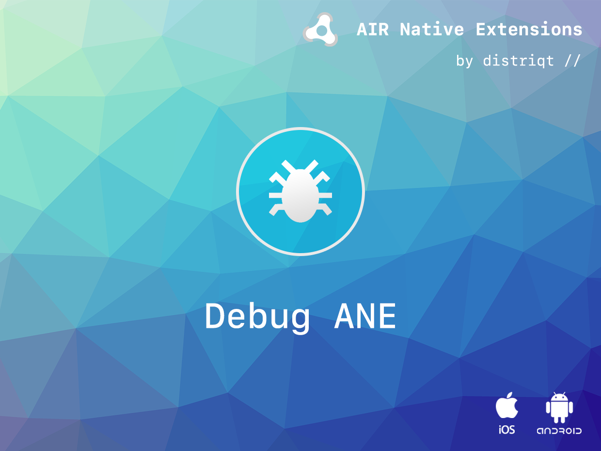

# Debug

The [Debug](https://airnativeextensions.com/extension/com.distriqt.Debug) extension gives you some useful tools to debug your application.  

This extension is useful during development to ensure your application can handle unexpected application behavioues, such as forcing a crash, and throwing an exception.

You can also use the native logging functionality to add custom logs into the system device logs.


### Features:

- Native logging;
- Force a crash;
- Throw an exception;
- List packaged android resources;
- Force app termination;
- Single API interface - your code works across supported platforms with no modifications
- Sample project code and ASDocs reference


As with all our extensions you get access to a year of support and updates as we are 
continually improving and updating the extensions for OS updates and feature requests.


## Documentation

The [Wiki](https://github.com/distriqt/ANE-Debug/wiki) forms the best source of detailed documentation for the extension along with the [asdocs](https://distriqt.github.io/ANE-Debug/asdocs). 

Quick Example: 

```actionscript
Debug.service.forceCrash();
```


